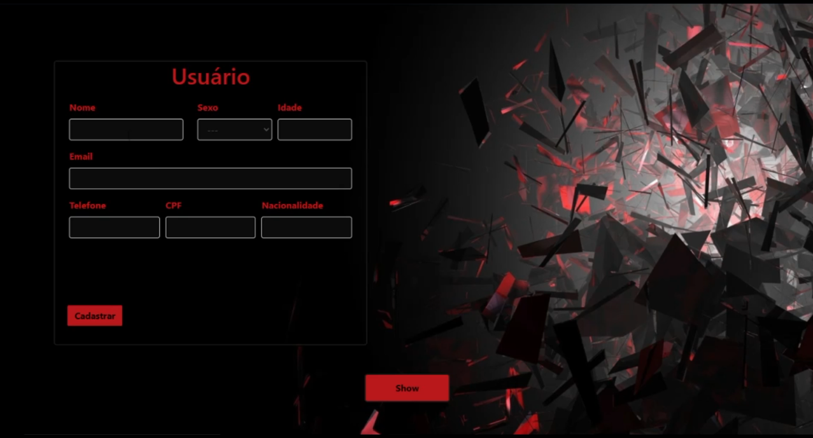

# CRUD-next-knex
Um site esteticamente simples implementando o CRUD com parte dos conhecimentos
aprendidos no nlw4, A parte frontend é feita usando nextjs,  typescript, contextApi,
usestate e useeffect. E o backend foi  realizado com o node e knex com o banco de dados mysql.
Ligar o frontend - yarn dev
Ligar o backend - npm run start

